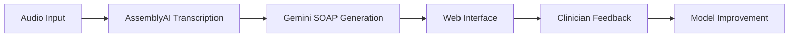

# AI Medical Scribe System

An automated SOAP note generator that transforms doctor-patient conversations into structured clinical notes using AssemblyAI for transcription and Google Gemini for medical note generation.

## Key Features

- **Audio Processing**: Handles 30-40 minute medical conversations
- **SOAP Note Generation**: Creates Subjective, Objective, Assessment, Plan sections
- **Traceability**: Maps every note line to source conversation segments
- **Clinician Review**: Supports hover-to-verify source dialogue

## System Architecture

Prerequisites:
- Python 3.10+
- Google Cloud account (for Gemini API)
- AssemblyAI account

## Setup
- git clone https://github.com/your-repo/medical-scribe.git
- cd medical-scribe

- pip install -r requirements.txt
- cp .env.example .env
- edit env:
  - ASSEMBLYAI_API_KEY=your_key_here
  - GOOGLE_API_KEY=your_key_here

## start the server
uvicorn app:app --reload --port 8000

- go to http://localhost:8000/docs

- Use "Try it out" on /process-file endpoint

- Upload a sample medical conversation

## Endpoints
Endpoints:

- POST /process-file - Upload audio (WAV/MP3)

- GET /soap-note/{id} - Retrieve generated SOAP note

- GET /status/{id} - Check processing status

